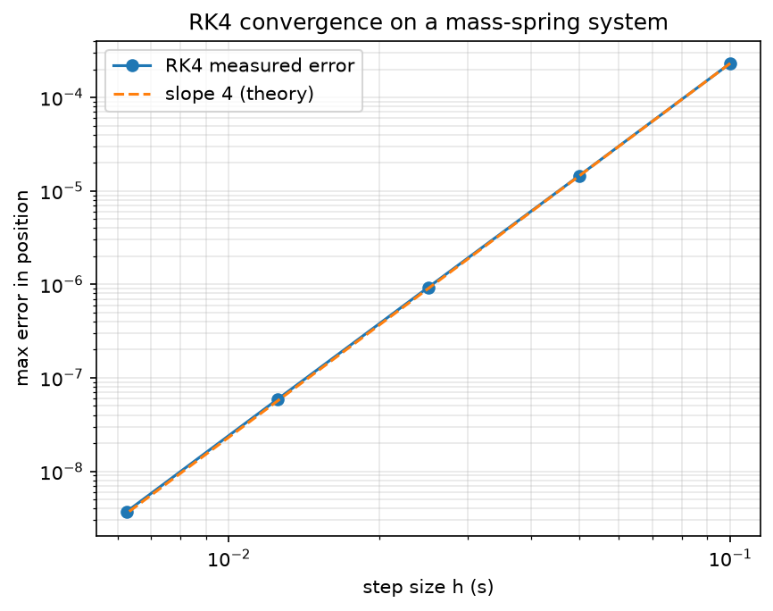

# physkit
Physics solvers, each tested/benchmarked against a known value (exact answer known)

# Setup
Create a folder containing `__init__.py` and `integrators.py`, then place that folder alongside `validate_rk4.py` in the parent directory.
Example:
  USER\Documents\physkit
    |---- physkit\ 
        |---- __init__.py 
        |---- integrators.py     <----- RK4 resides here.
    |----validate_rk4.py 

# Validation

| Module  | `integrators.rk4`                                                                      | 
| Test    |Mass-spring system vs exact cos(ωt)                                                     | 
| Result  |Error falls ~16× per step halving (measured: 15.9×) → 4th-order convergence confirmed   |



# Run the test
```
pip install numpy matplotlib
python validate_rk4.py
```
----- ---- OR ---- -----
```
pip install numpy
pip install matplotlib
python validate_rk4.py
```

# Possible Error
If pip install isn't working using following should help install libraries
  `python -m pip install package_name`
  here package_name is numpy or matplot lib.
If `python validate_rk4.py` dosen't work
  Execute/Run validate_rk4.py using Editor Toolbar

# Development Environment

This project was developed using `Visual Studio Code (VS Code)` and `Python 3.14.6`.

The code was written, organised, and tested within the VS Code development environment.
